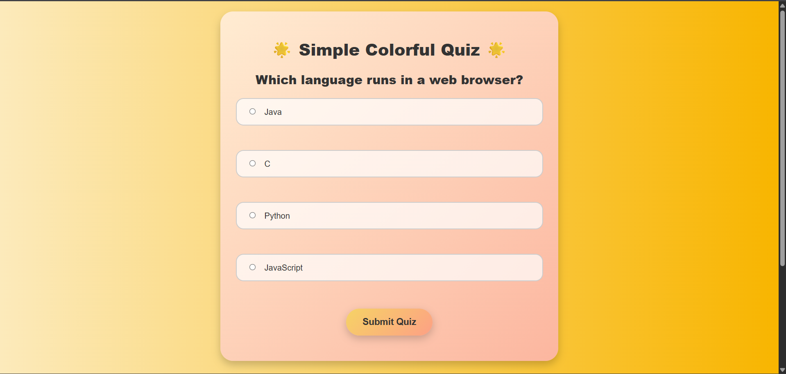
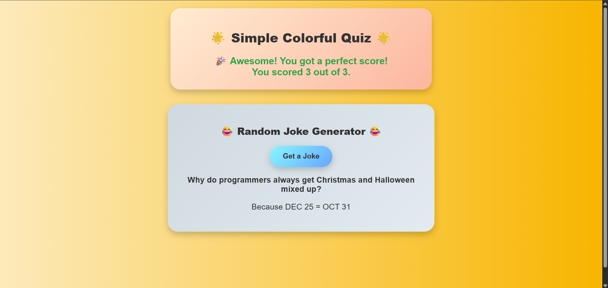

# 🌐 Apex Planet Internship - Task 3

This project is part of the Apex Planet Internship Program, demonstrating the application of HTML, CSS, JavaScript, and API integration to build a responsive and interactive web application.

---

## 📌 Project Title  
Quiz Application with API Integration

---

## 📁 Description

A colorful, responsive web page featuring:

- A multiple-choice quiz with score calculation
- Personalized feedback based on quiz performance
- Integration with the Official Joke API to fetch random jokes
- Responsive layout using modern CSS
- JavaScript DOM manipulation, event handling, and API Fetch

---

## 🚀 Features

🎨 Colorful, modern UI design  
✅ Multiple-choice quiz (3 questions)  
✅ Score calculation with dynamic feedback  
🌐 Random joke fetching from external API  
📱 Fully responsive design (mobile-friendly)

---

## 🔧 Technologies Used

- HTML5
- CSS3
- JavaScript (Vanilla JS)
- Fetch API
- Git & GitHub

---
## 📂 How to Run

1. Clone or download the repository.
2. Open `index.html` in any modern web browser.
3. Start the quiz and fetch random jokes.

---
## 🌐 Live Demo

You can view the live project here:  
[Live Demo](https://lavs2005.github.io/Apex-Task-3/)

## 📷 Screenshots

### Quiz Section

### API Joke Section

### Full Page Layout

